# Índice de telas

Todas as telas do app num só lugar, em ordem de uso. Capturas do app real num celular Android (emulador 1080×2400); retrato na biblioteca, paisagem na partitura. Cada foto leva o número do arquivo em [`celular/`](celular/).

- Como refazer as fotos e o que elas não mostram: [`celular/README.md`](celular/README.md).
- Análise de UX a partir delas: [`../ux/estudo-ux-celular.md`](../ux/estudo-ux-celular.md).
- As mesmas telas em retrato e em paisagem, lado a lado: [`ORIENTACAO.md`](ORIENTACAO.md); análise em [`../ux/estudo-ux-orientacao.md`](../ux/estudo-ux-orientacao.md).
- Protótipo navegável (não é o app): `lib/mockup/` e `lib/main_mockup.dart` — não entra nas fotos.

Total: 60 telas.

## Abertura e biblioteca

Retrato. O que o aluno vê ao abrir o app e ao escolher um hino.

Código: `lib/splash_screen.dart` · `lib/library/library_screen.dart`

<table><tr><td align="center"> <b>01</b> · Abertura (splash)</td><td align="center"><a href="celular/02-biblioteca-primeiro-uso.png">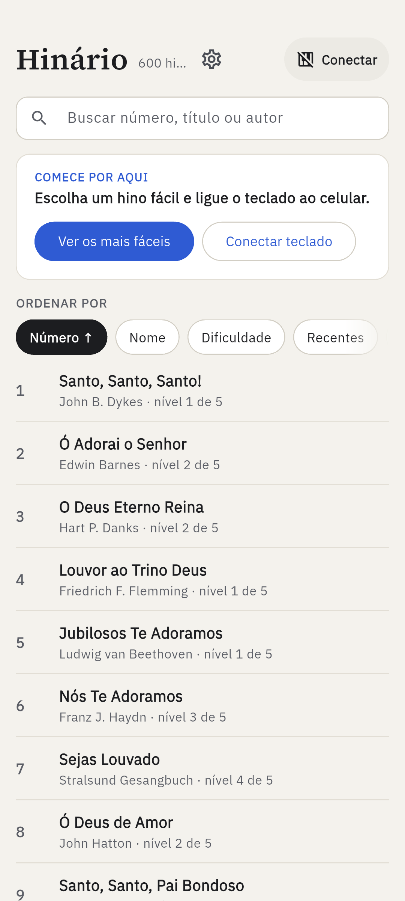</a> <b>02</b> · Biblioteca, primeiro uso</td><td align="center"><a href="celular/03-biblioteca-busca.png">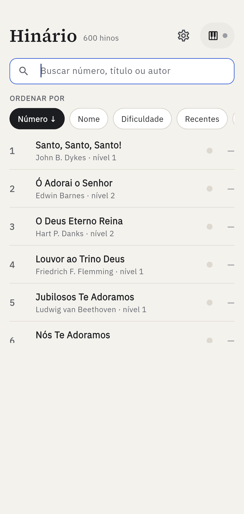</a> <b>03</b> · Busca com resultados</td><td align="center"><a href="celular/04-biblioteca-busca-sem-resultado.png">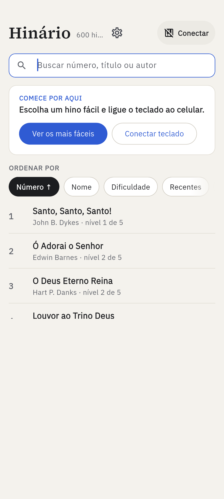</a> <b>04</b> · Busca sem resultado</td></tr></table>

<table><tr><td align="center"><a href="celular/05-biblioteca-por-dificuldade.png">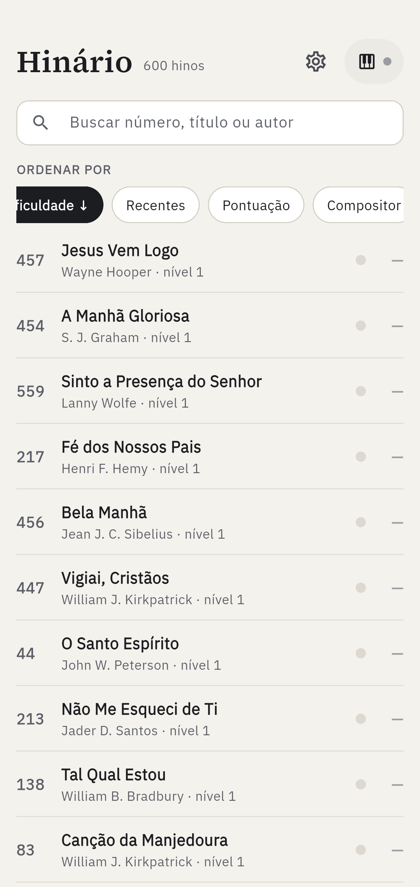</a> <b>05</b> · Ordenada por dificuldade</td><td align="center"><a href="celular/26-biblioteca-continuar.png">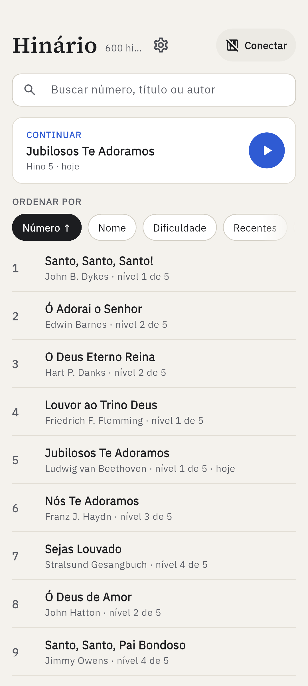</a> <b>26</b> · Biblioteca com “Continuar”</td><td align="center"> <b>27</b> · Biblioteca com histórico</td><td align="center"><a href="celular/28-biblioteca-por-pontuacao.png">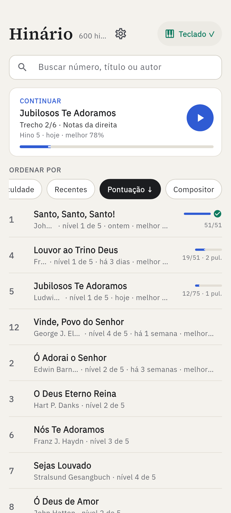</a> <b>28</b> · Ordenada por pontuação</td></tr></table>

<table><tr><td align="center"><a href="celular/46-biblioteca-depois-do-estudo.png">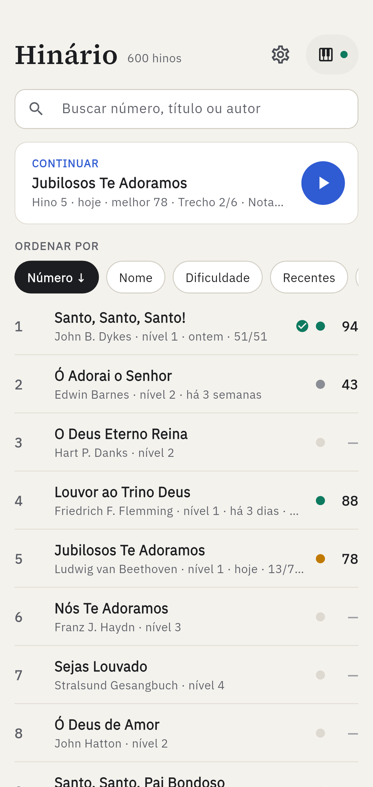</a> <b>46</b> · Biblioteca depois do estudo</td></tr></table>

## Teclado MIDI e configurações

Retrato (06, 29, 07–09) e paisagem (43–45). Seletor de teclado, configurações gerais e ferramentas de MIDI.

Código: `lib/midi/midi_device_picker.dart` · `lib/settings/general_settings_panel.dart` · `lib/settings/color_picker.dart` · `lib/midi/midi_monitor_panel.dart`

<table><tr><td align="center"><a href="celular/06-teclado-midi-nenhum.png">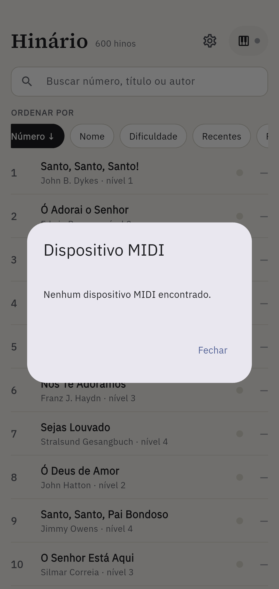</a> <b>06</b> · Teclado MIDI: nenhum</td><td align="center"><a href="celular/29-teclado-midi-conectado.png">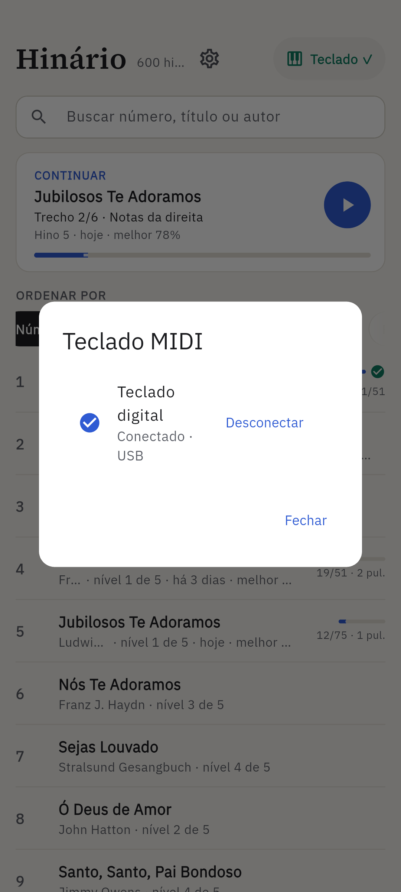</a> <b>29</b> · Teclado MIDI: conectado</td><td align="center"><a href="celular/07-configuracoes.png">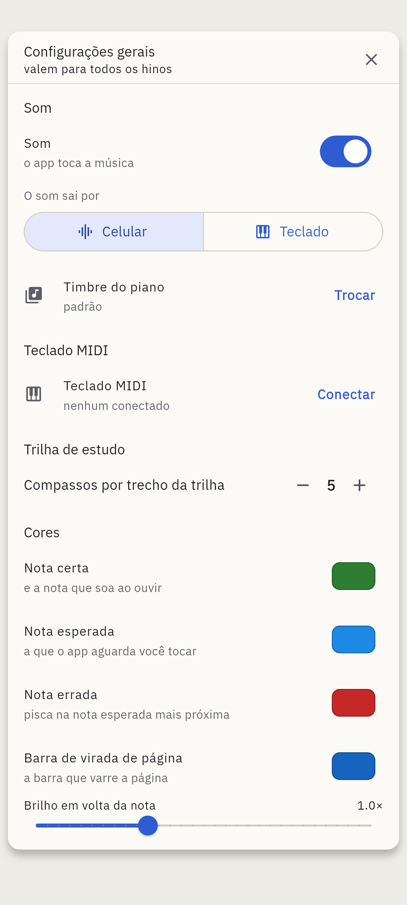</a> <b>07</b> · Configurações gerais</td><td align="center"><a href="celular/08-configuracoes-mudar-o-padrao.png">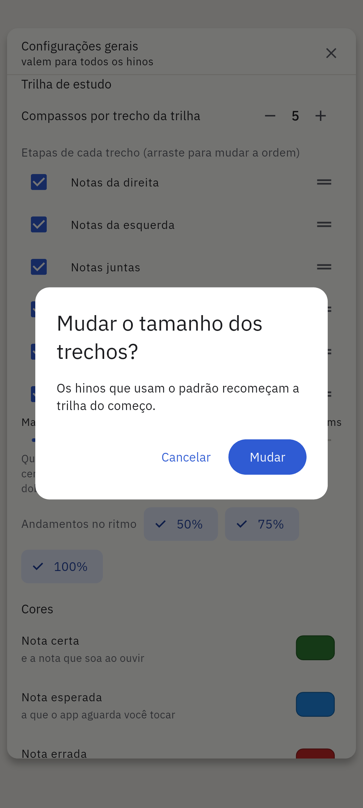</a> <b>08</b> · Confirmação “Mudar o tamanho dos trechos?”</td></tr></table>

<table><tr><td align="center"><a href="celular/09-seletor-de-cor.png">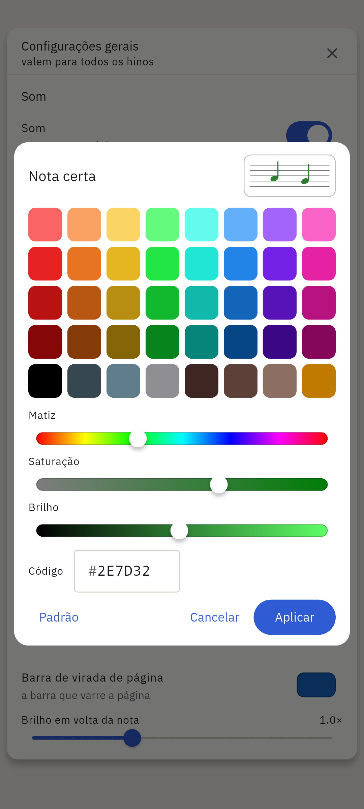</a> <b>09</b> · Seletor de cor</td></tr></table>

<table><tr><td align="center"><a href="celular/43-configuracoes-com-teclado.png">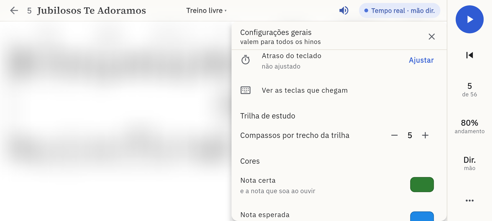</a> <b>43</b> · Configurações com teclado</td><td align="center"><a href="celular/44-calibrar-latencia.png">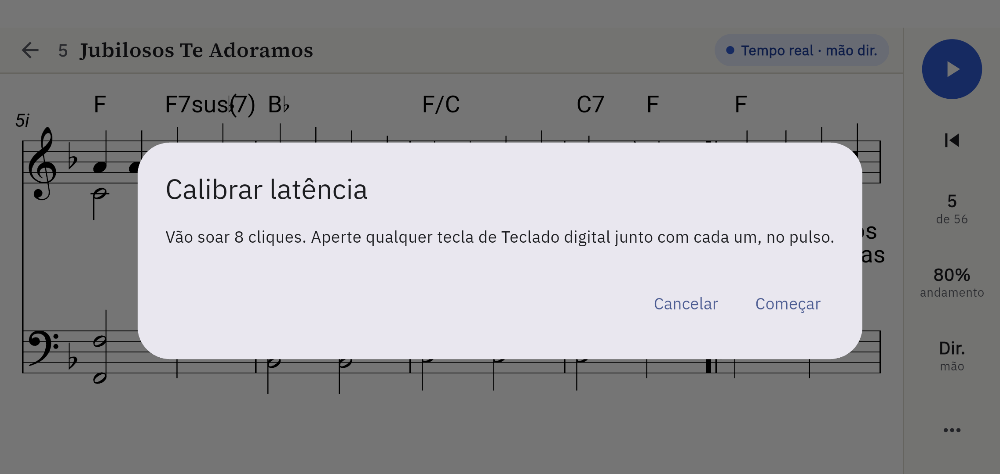</a> <b>44</b> · Ajustar o atraso</td></tr></table>

<table><tr><td align="center"><a href="celular/45-monitor-midi.png">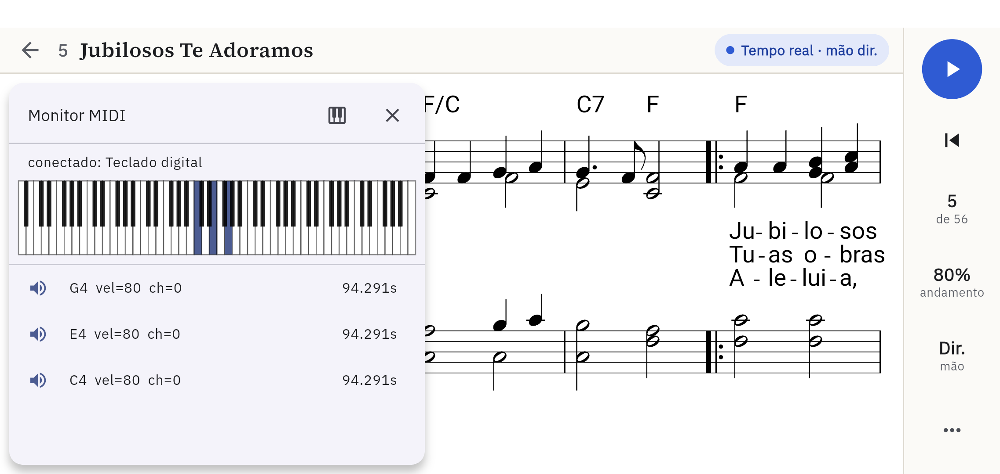</a> <b>45</b> · Monitor MIDI (“Teclas que chegam”)</td></tr></table>

## Partitura e trilha de estudo

Paisagem. O hino aberto, a trilha por trechos e a gaveta de etapas.

Código: `lib/main.dart` · `lib/trail/trail_widgets.dart` · `lib/ui/side_panel.dart`

<table><tr><td align="center"><a href="celular/10-hino-abrindo.png">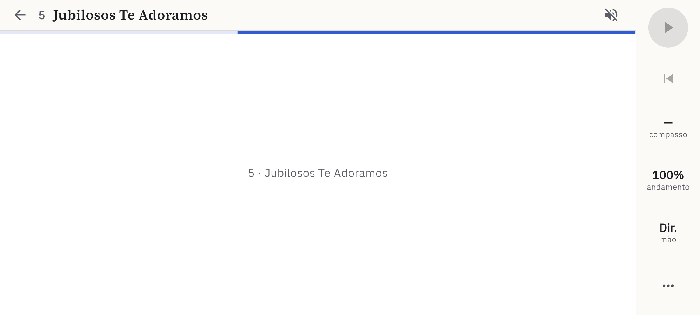</a> <b>10</b> · Partitura sendo gravada</td><td align="center"><a href="celular/11-trilha-sem-teclado.png">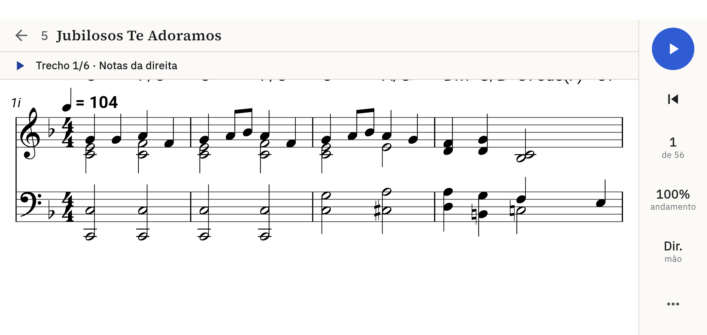</a> <b>11</b> · Trilha sem teclado</td></tr></table>

<table><tr><td align="center"><a href="celular/12-ouvindo-o-trecho.png">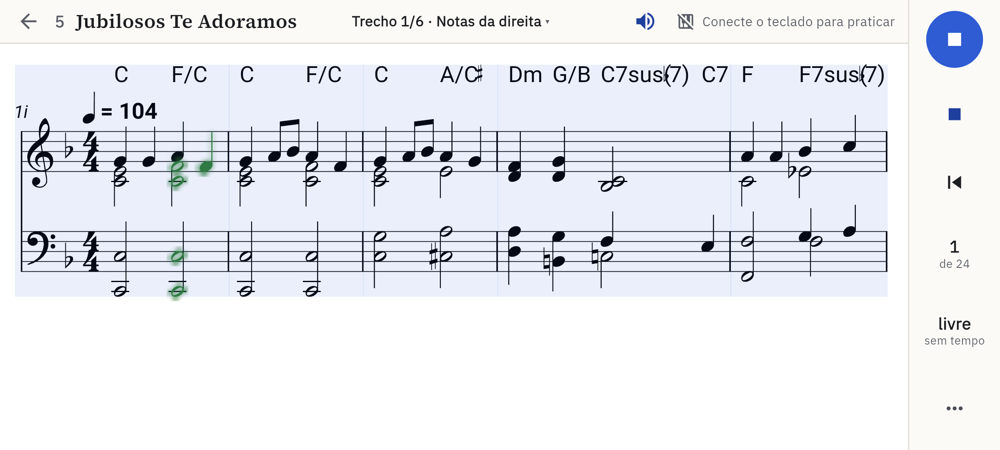</a> <b>12</b> · Ouvindo o trecho</td><td align="center"><a href="celular/13-gaveta-da-trilha.png">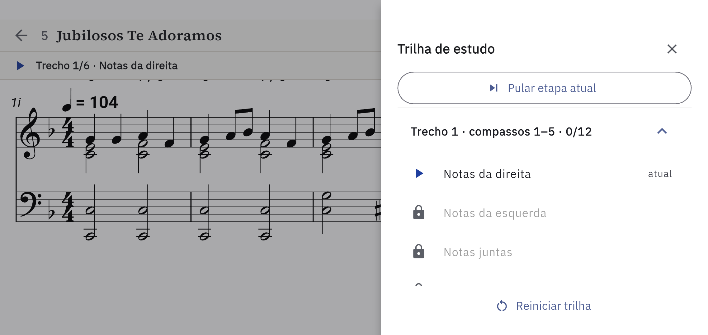</a> <b>13</b> · Gaveta da trilha</td></tr></table>

<table><tr><td align="center"> <b>30</b> · Trilha retomada</td><td align="center"><a href="celular/31-gaveta-da-trilha-com-progresso.png">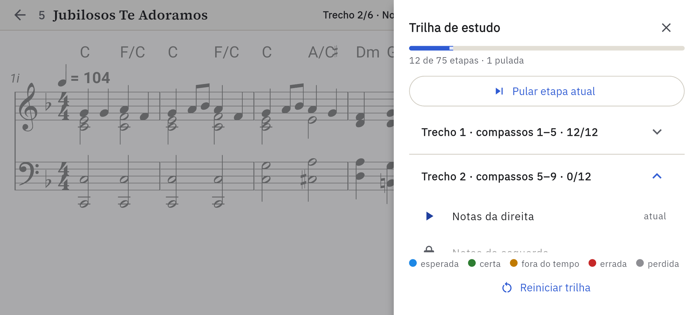</a> <b>31</b> · Gaveta da trilha com progresso</td></tr></table>

<table><tr><td align="center"><a href="celular/36-gaveta-etapas-concluidas.png">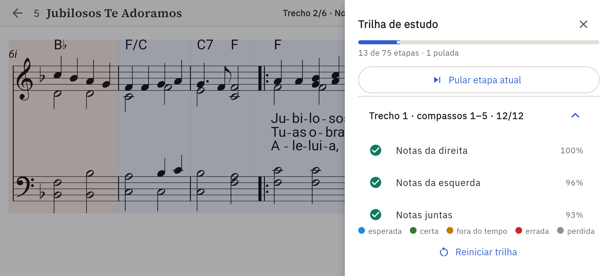</a> <b>36</b> · Gaveta: etapas concluídas</td></tr></table>

## Opções e ajustes da partitura

Paisagem. Painéis laterais abertos sobre a partitura.

Código: `lib/mockup/options_panel.dart` · `lib/layout_panel.dart` · `lib/practice/practice_tools.dart`

<table><tr><td align="center"><a href="celular/14-opcoes-de-estudo.png">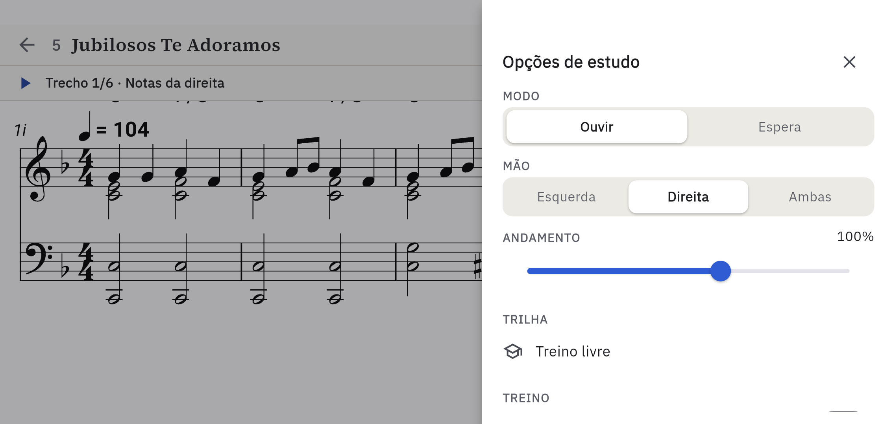</a> <b>14</b> · Opções de estudo (começo)</td><td align="center"><a href="celular/15-opcoes-de-estudo-meio.png">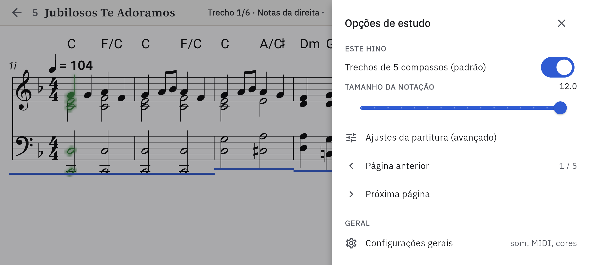</a> <b>15</b> · Opções de estudo (meio)</td></tr></table>

<table><tr><td align="center"> <b>16</b> · Opções de estudo (fim)</td><td align="center"> <b>17</b> · Ajustes da partitura</td></tr></table>

<table><tr><td align="center"><a href="celular/18-configuracoes-na-partitura.png">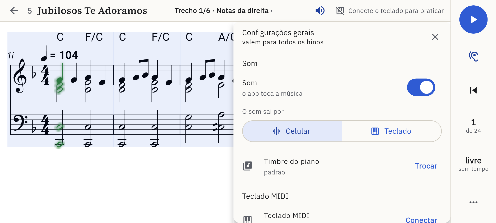</a> <b>18</b> · Configurações sobre a partitura</td><td align="center"><a href="celular/19-ir-para-compasso.png">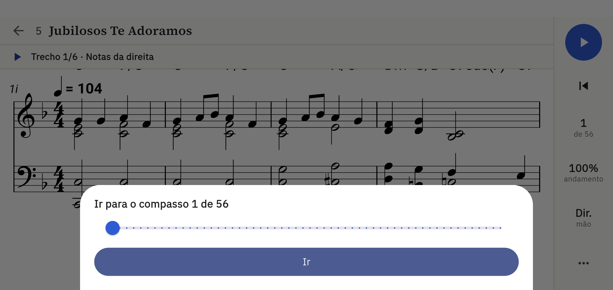</a> <b>19</b> · Ir para um compasso</td></tr></table>

<table><tr><td align="center"><a href="celular/20-repetir-um-trecho.png">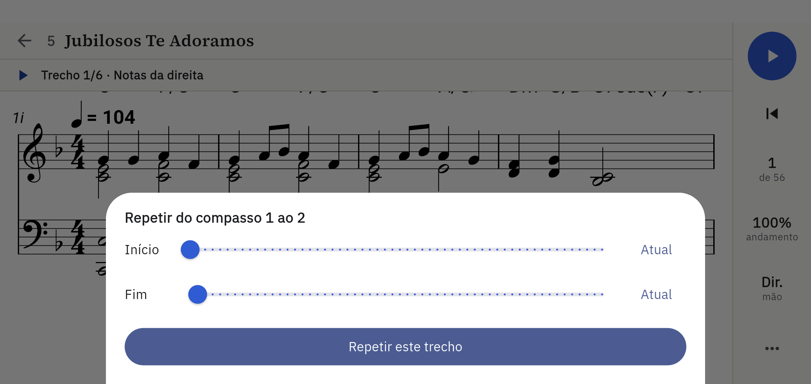</a> <b>20</b> · Repetir um trecho</td></tr></table>

## Treino livre

Paisagem. Tocar o hino sem trilha, com contagem e resumo.

Código: `lib/practice/count_in_overlay.dart` · `lib/practice/practice_tools.dart`

<table><tr><td align="center"><a href="celular/21-treino-livre.png">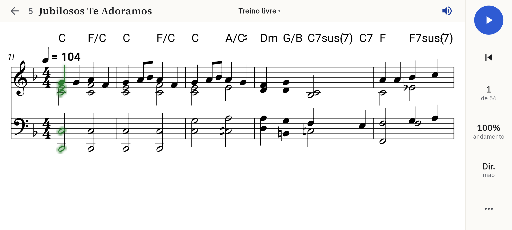</a> <b>21</b> · Treino livre, parado</td><td align="center"><a href="celular/22-contagem.png">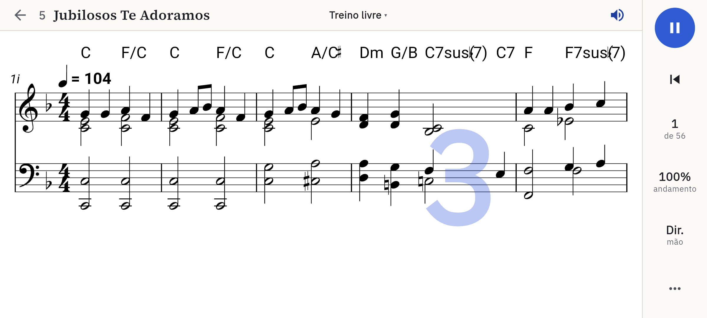</a> <b>22</b> · Contagem regressiva</td></tr></table>

<table><tr><td align="center"> <b>23</b> · Tocando (virada de página)</td><td align="center"><a href="celular/24-opcoes-modo-espera.png">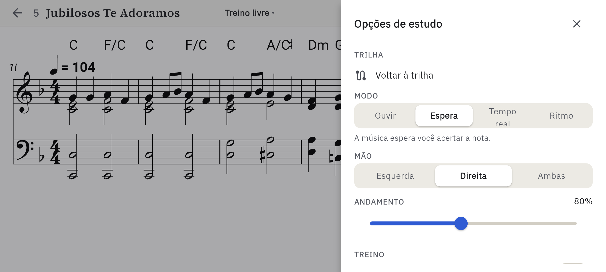</a> <b>24</b> · Opções com modo Espera</td></tr></table>

<table><tr><td align="center"><a href="celular/25-espera-sem-teclado.png">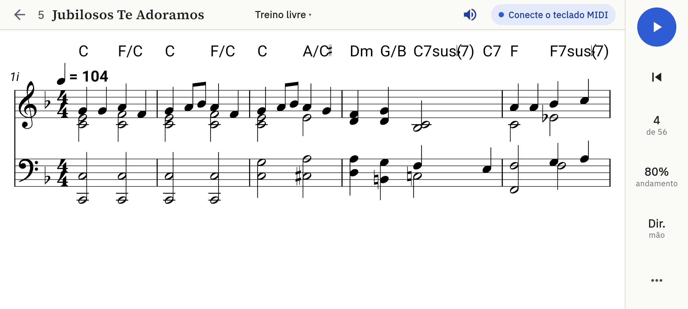</a> <b>25</b> · Modo espera sem teclado</td><td align="center"><a href="celular/40-opcoes-treino-em-tempo-real.png">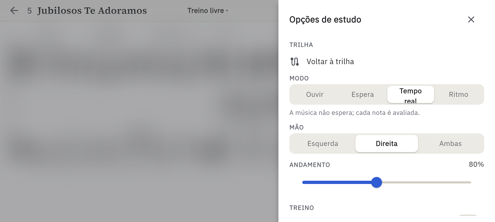</a> <b>40</b> · Opções do treino em tempo real</td></tr></table>

<table><tr><td align="center"><a href="celular/41-treino-livre-tempo-real.png">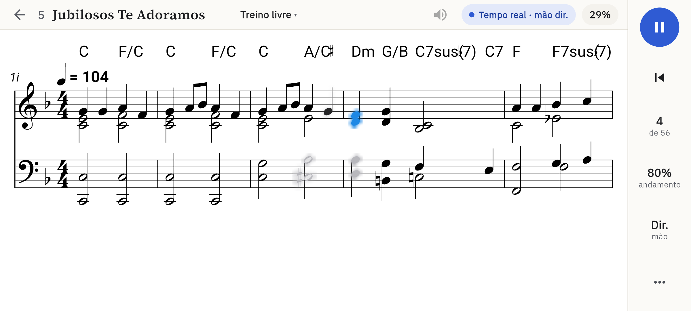</a> <b>41</b> · Treino livre em tempo real</td><td align="center"><a href="celular/42-resumo-do-treino.png">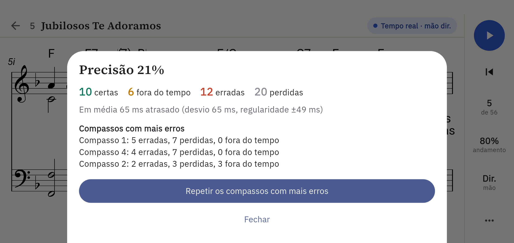</a> <b>42</b> · Resumo do treino</td></tr></table>

## Etapas da trilha

Paisagem. Uma etapa em andamento, do início ao resumo.

Código: `lib/trail/trail_widgets.dart` · `lib/ui/practice_legend.dart`

<table><tr><td align="center"><a href="celular/32-etapa-espera.png">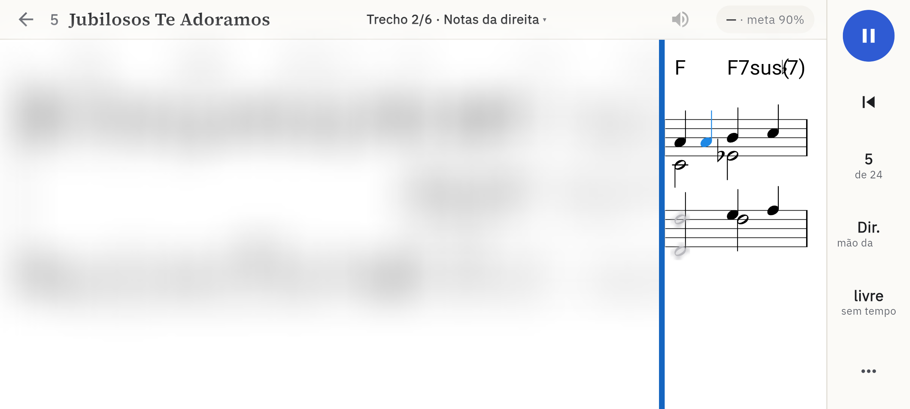</a> <b>32</b> · Etapa do modo espera</td><td align="center"><a href="celular/33-etapa-nota-errada.png">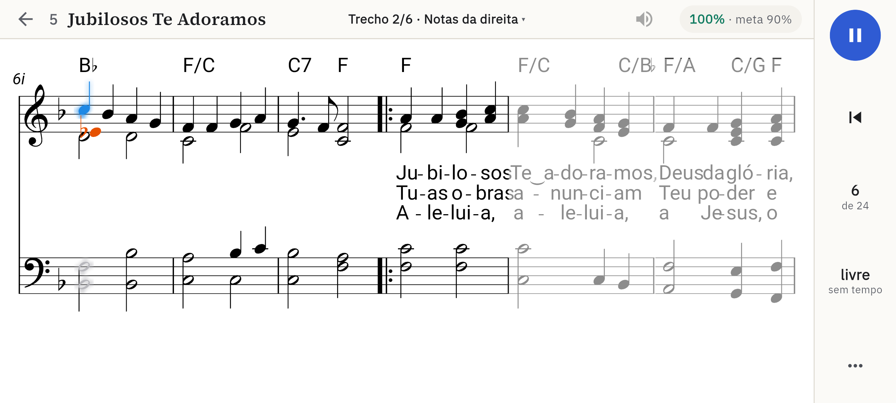</a> <b>33</b> · Etapa com tecla errada</td></tr></table>

<table><tr><td align="center"><a href="celular/34-resumo-da-etapa.png">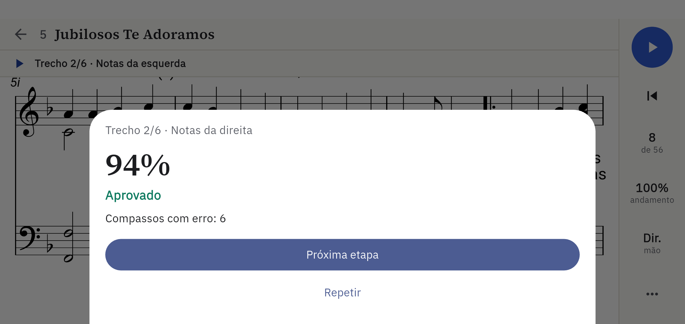</a> <b>34</b> · Resumo da etapa aprovada</td><td align="center"><a href="celular/35-proxima-etapa.png">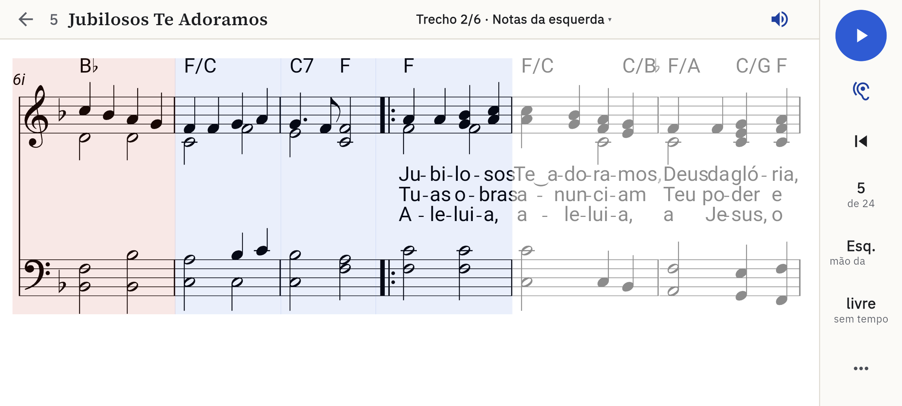</a> <b>35</b> · Etapa seguinte</td></tr></table>

<table><tr><td align="center"> <b>37</b> · Etapa com contagem</td><td align="center"> <b>38</b> · Etapa em tempo real</td></tr></table>

<table><tr><td align="center"> <b>39</b> · Resumo da etapa reprovada</td></tr></table>

## Cursos da fase I

Retrato (47–58), paisagem no exercício com partitura (59–60). O curso inicial embutido, a lição 2 e os três tipos de exercício com e sem teclado.

Código: `lib/course/ui/courses_screen.dart` · `lib/course/ui/course_screen.dart` · `lib/course/ui/lesson_screen.dart` · `lib/course/ui/exercise_screen.dart`

<table><tr><td align="center"><a href="celular/47-curso-inicial-sem-biblioteca.png">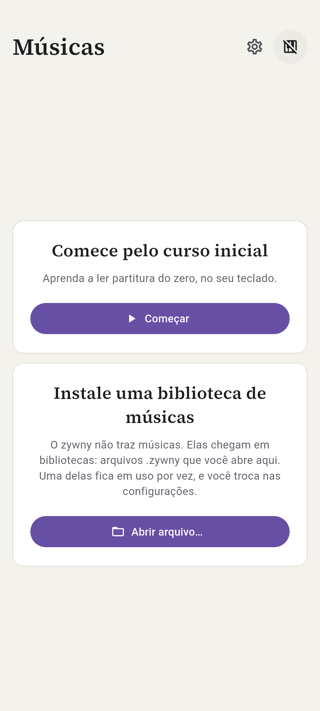</a> <b>47</b> · Curso inicial sem biblioteca</td><td align="center"><a href="celular/48-licao-1-pelo-cartao.png">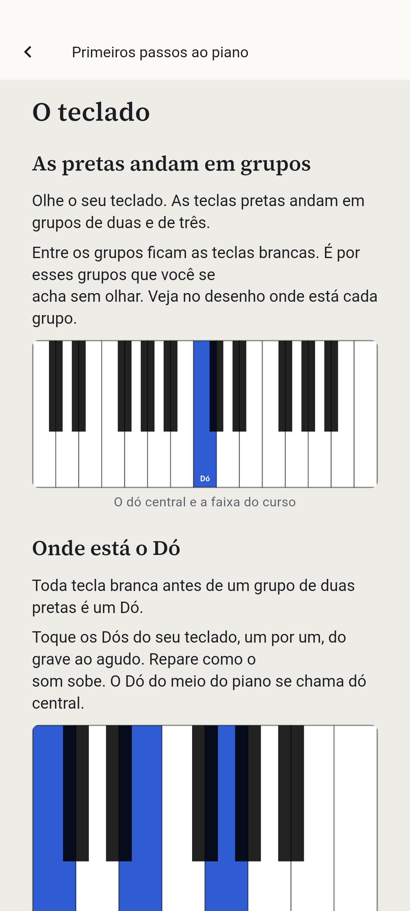</a> <b>48</b> · Lição 1 pelo cartão</td><td align="center"><a href="celular/49-biblioteca-com-cursos.png">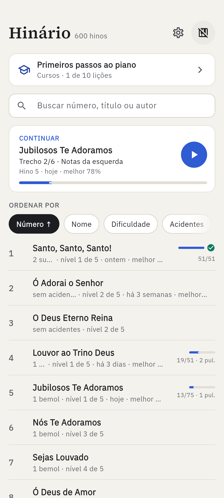</a> <b>49</b> · Biblioteca com “Cursos”</td><td align="center"><a href="celular/50-lista-de-cursos.png">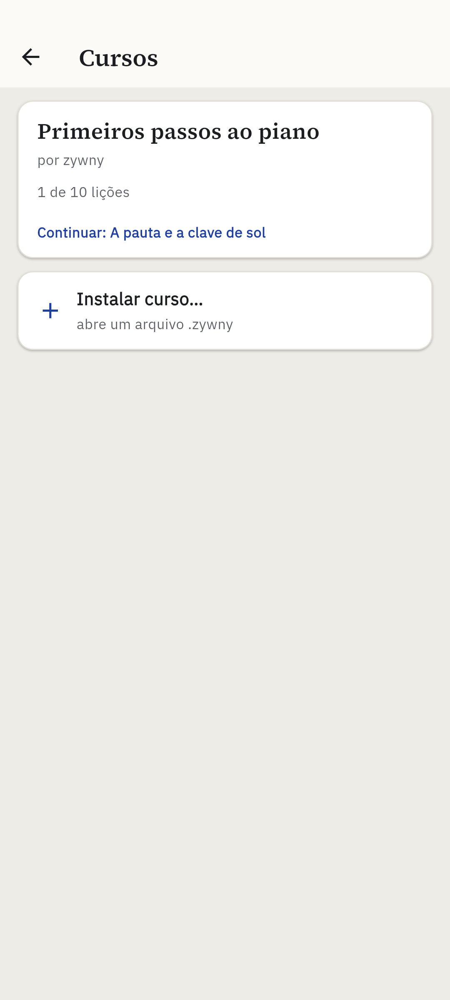</a> <b>50</b> · Lista de cursos</td></tr></table>

<table><tr><td align="center"><a href="celular/51-tela-do-curso.png">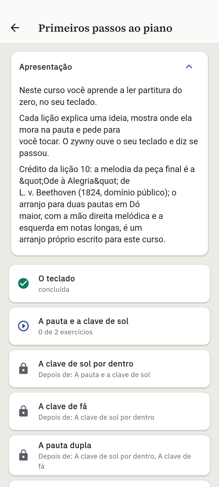</a> <b>51</b> · Curso: feita, aberta, bloqueadas</td><td align="center"><a href="celular/52-licao-2-topo.png">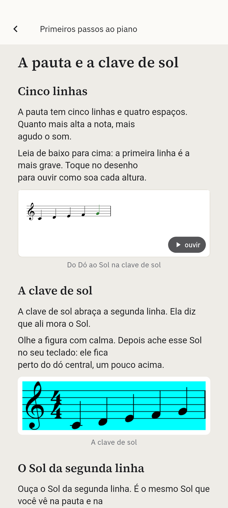</a> <b>52</b> · Lição 2 (topo)</td><td align="center"><a href="celular/53-licao-2-partitura.png">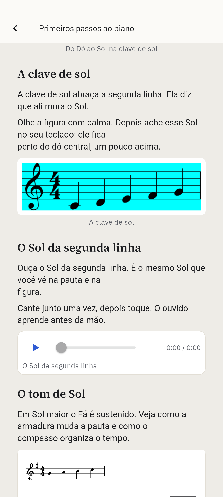</a> <b>53</b> · Lição 2 (partitura)</td><td align="center"><a href="celular/54-licao-2-exercicio.png">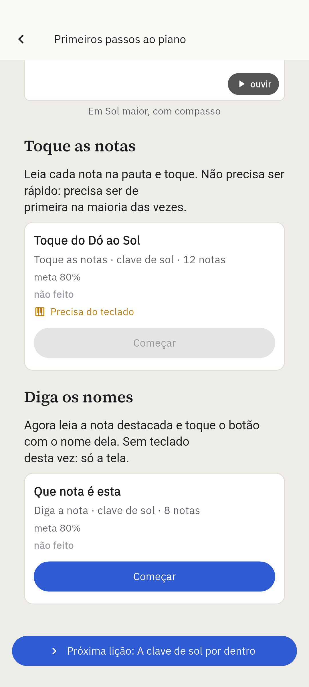</a> <b>54</b> · Lição 2 (“Precisa do teclado”)</td></tr></table>

<table><tr><td align="center"><a href="celular/55-exercicio-conecte-o-teclado.png">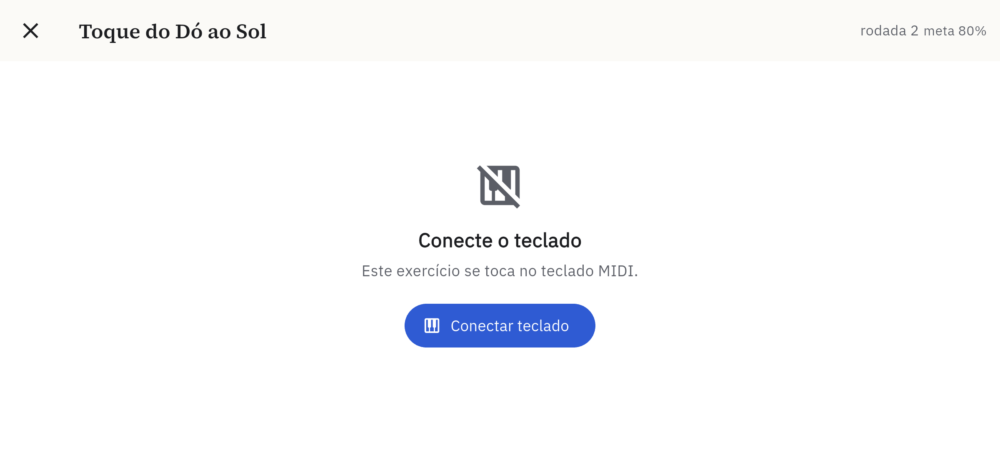</a> <b>55</b> · “Conecte o teclado”</td><td align="center"><a href="celular/56-exercicio-name-note.png">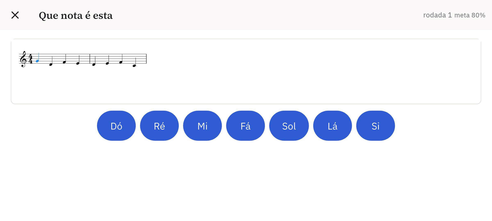</a> <b>56</b> · Exercício `name-note`</td></tr></table>

<table><tr><td align="center"><a href="celular/57-licao-8-choice-cartao.png">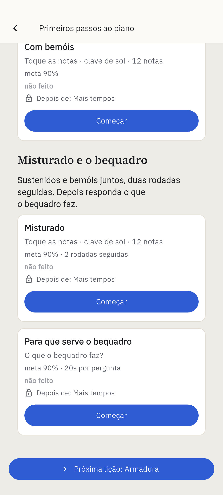</a> <b>57</b> · Cartão do `choice`</td><td align="center"><a href="celular/58-exercicio-choice.png">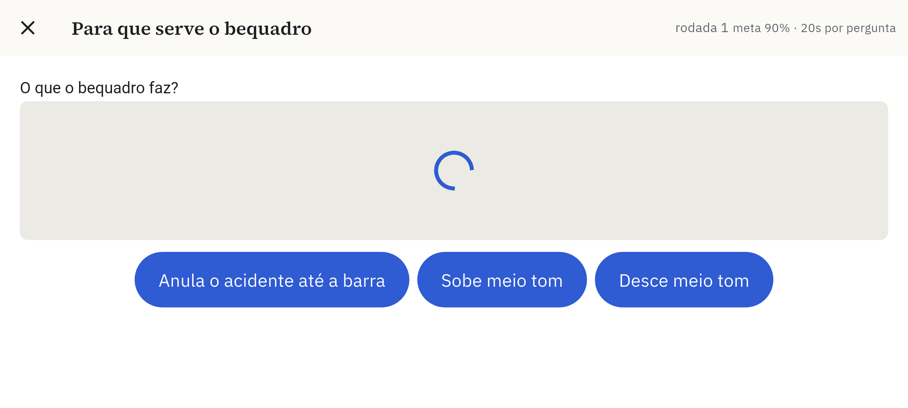</a> <b>58</b> · Exercício `choice`</td></tr></table>

<table><tr><td align="center"><a href="celular/59-exercicio-play-notes-antes.png">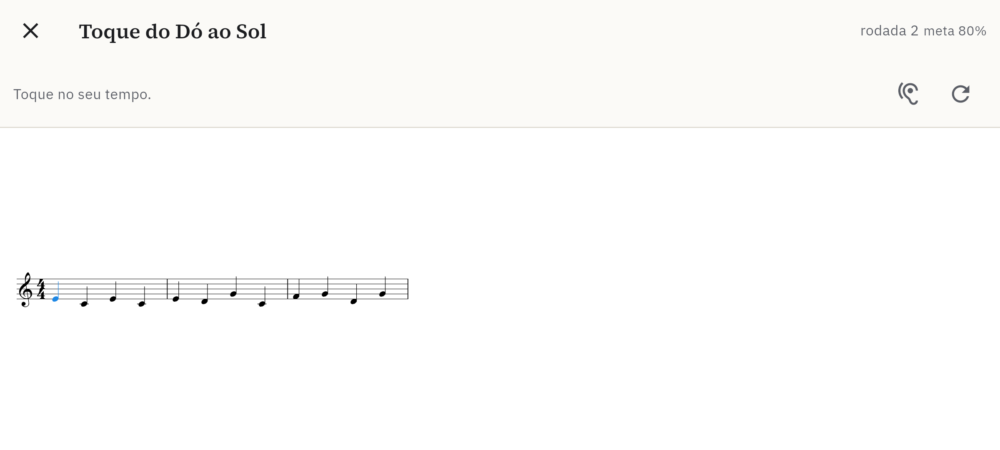</a> <b>59</b> · `play-notes` antes</td><td align="center"><a href="celular/60-exercicio-play-notes-depois.png">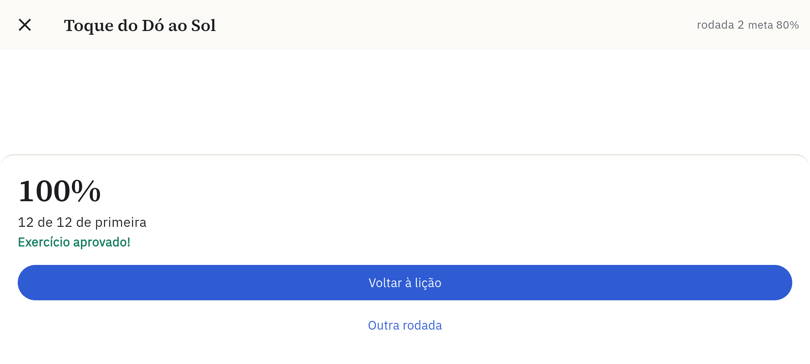</a> <b>60</b> · `play-notes` aprovado</td></tr></table>
