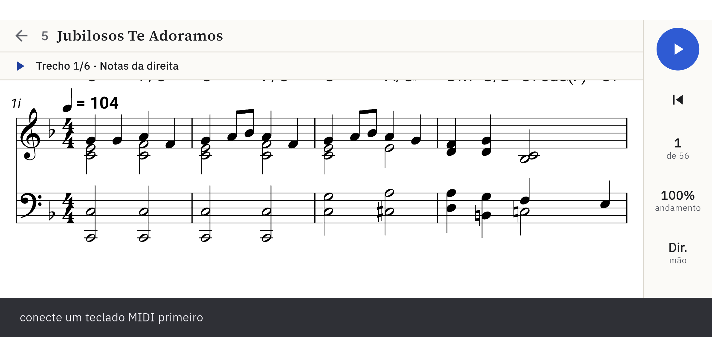
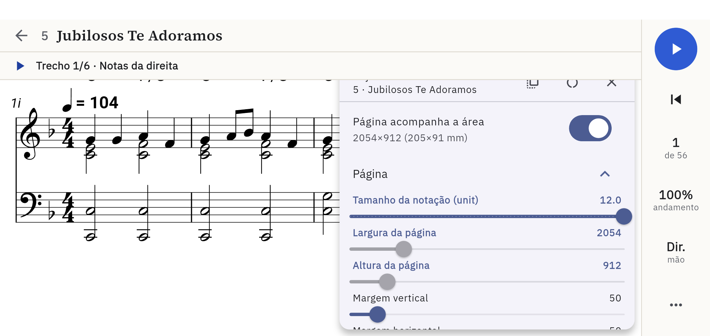
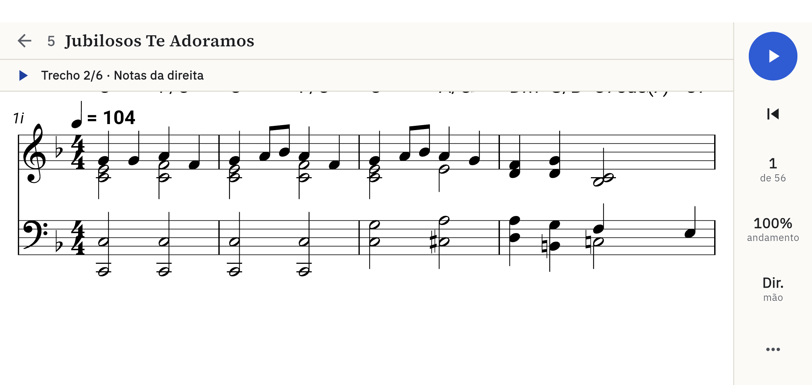
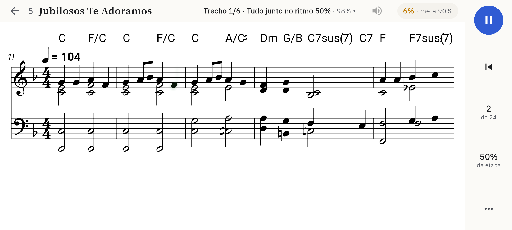
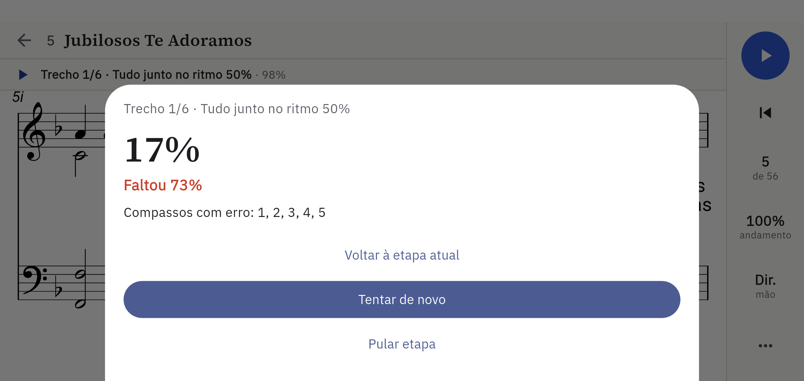
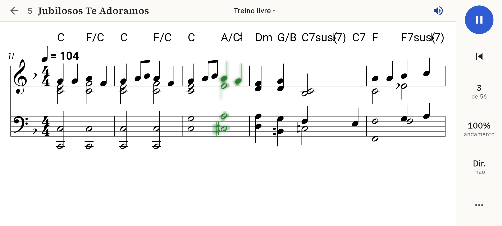
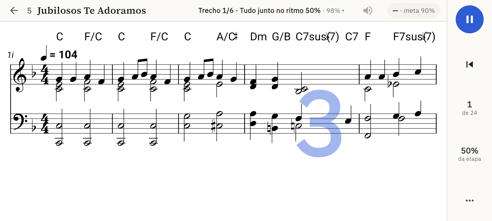
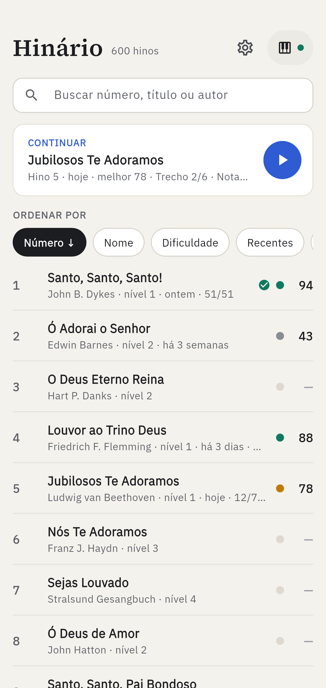

# Estudo de UX — telas do celular

Avaliação das 46 telas de `docs/telas/celular/` (2026-10-02, versão 1.0.3+4,
branch `biblioteca-de-hinos`). Os números entre parênteses — (11), (33) —
são os das telas; o índice está no README daquela pasta.

## Método e limites

- **Avaliação heurística**, de um avaliador só, sobre as fotos e o código que
  as desenha. Não é teste com usuário: os achados são hipóteses bem
  fundamentadas, não medições. Onde a dúvida é grande, está dito.
- As fotos vêm de um emulador (411×914 dp), sem som e com um teclado MIDI
  falso. Não avaliei o que só se percebe tocando: latência, se o metrônomo
  ajuda, se os 90% são justos, cansaço numa sessão longa.
- Não reabro o que foi decidido em `J00`/`L00` (trilha como tela padrão, 12
  etapas por trecho, 90% fixo, modos livres num menu secundário). Quando um
  achado encosta numa dessas decisões, aponto o custo e deixo a decisão onde
  está.

Gravidade: **alta** — engana o aluno ou trava o caminho principal;
**média** — atrapalha, mas ele passa; **baixa** — acabamento.

## Resumo

O esqueleto é bom: a biblioteca é limpa e acha um hino em segundos, a
partitura ocupa a tela, a faixa da trilha diz onde o aluno está e a nota
fantasma mostra o erro no lugar exato. Os problemas se concentram em três
pontos:

1. **O primeiro contato emperra.** Sem teclado, a tela padrão não faz nada;
   o caminho para só ouvir fica três toques adiante, e toca mudo.
2. **A partitura perde para o que está por cima dela.** A faixa da trilha
   cobre cifras e cabeçalhos de painel, a contagem cobre os compassos que o
   aluno deveria estar lendo, e a virada de página esconde o que vem a
   seguir.
3. **O retorno durante o treino não bate com o resultado.** O selo de
   acertos e erros conta uma coisa, o resumo outra; a barra lateral mostra
   andamento e mão que a etapa não está usando.

Se só der para fazer cinco coisas: A1, A2, A3, A5 e A6.

## O que funciona — manter

- **Biblioteca** (02, 27): uma linha por hino, número em destaque, busca que
  aceita número, título e autor sem acento. O cartão "Continuar" leva direto
  à etapa em que o aluno parou.
- **Partitura em tela cheia** com os controles numa barra à direita, ao
  alcance do polegar; o play é o maior alvo da tela (52 dp).
- **Faixa da trilha** (11): uma linha, discreta, com trecho e etapa. A
  gaveta (31, 36) usa cadeado, ✓ com a melhor porcentagem e "atual" — lê-se
  de relance.
- **Nota fantasma** (33): a tecla errada aparece na pauta, na altura em que
  foi tocada, ao lado da esperada. É o melhor retorno do app.
- **Resumo da etapa** (34): número grande, veredito numa palavra, uma ação
  principal.
- Teclado que conecta sozinho ao ser plugado; confirmação antes do que apaga
  progresso (08).

## Achados

### A — Partitura e trilha

**A1 · alta · Sem teclado, a tela padrão é um beco.** (11, 12)

Quem abre um hino antes de ligar o teclado — todo mundo, na primeira vez —
aperta o play e recebe "conecte um teclado MIDI primeiro" numa barra preta,
em minúsculas e sem ação. Não dá nem para ouvir o trecho: ouvir está em
⋯ → "Treino livre" → play.

- Dizer isso antes do toque: com o teclado ausente, a faixa vira
  "Conecte o teclado para praticar" e o play toca o trecho.
- "Ouvir o trecho" deveria existir sempre, com ou sem teclado: ouvir antes
  de tocar é parte do estudo, não um modo à parte.
- Na barra de aviso, uma ação ("Conectar").

**A2 · alta · O som nasce desligado, e nada na tela avisa.** (07, 23)
"Som do app" começa desligado. No primeiro play as notas acendem em
silêncio; o aluno conclui que o app está quebrado ou que o celular está no
mudo. O interruptor fica em ⋯ → Configurações gerais.

- Ligar por padrão; ou, desligado, mostrar um alto-falante riscado na barra
  lateral que liga com um toque.

**A3 · alta · A faixa da trilha cobre a partitura e os painéis.** (11, 17, 18)

A faixa fica por cima da área gravada. Resultado: as cifras da primeira
linha aparecem cortadas ao meio em toda tela de trilha (11, 30, 32), e os
painéis "Layout deste hino" e "Configurações gerais" abrem com o título
escondido e os botões de fechar, copiar e restaurar cortados (17, 18). No
treino livre, sem faixa, o mesmo painel aparece inteiro (43).

- Reservar os 34 dp da faixa sempre (também no livre, para não regravar a
  página ao alternar) e ancorar os painéis abaixo dela.

**A4 · alta · A partitura não mostra o trecho da etapa.** (30)

A faixa diz "Trecho 2/6", a gaveta diz "compassos 5–9", e a tela mostra os
compassos 1–4. Só ao apertar o play a página certa aparece (32). O aluno não
consegue olhar o que vai tocar antes de tocar, e nada na pauta marca onde o
trecho começa e acaba.

- Ao selecionar uma etapa, ir para o primeiro compasso do trecho.
- Marcar o intervalo na pauta (colchete ou fundo leve) e esmaecer o resto.

**A5 · alta · O selo de acertos não prevê o resultado.** (38→39, 41→42)
 

No meio da etapa o selo marcava ✓ 10 ✗ 8; o resumo deu 10%. No treino livre,
✓ 10 ✗ 10 virou "Precisão 7%" — 4 certas, 6 fora do tempo, 18 erradas, 26
perdidas. O selo e o resultado usam réguas diferentes (fora do tempo, notas
perdidas), e o aluno não tem como saber se está passando.

- O selo deve usar a régua do resultado: a porcentagem corrente contra a
  meta ("72% · meta 90%"), ou os mesmos quatro números do resumo.

**A6 · alta, a validar · A virada de página esconde o que vem a seguir.** (23, 25, 41)

Enquanto o último compasso da página toca, a página seguinte já está à
esquerda da haste, desfocada. Com quatro compassos por página, a leitura à
frente cai a zero a cada quatro compassos — e ler adiante é o que se treina
ao piano. Pausar no meio da virada congela a tela com dois terços borrados
(25), e a gaveta de opções abre sobre esse borrão (24).

O desfoque foi uma decisão (o foco é o fim da página que ainda toca). O
custo merece um teste com aluno. Sem mexer na decisão:

- ao pausar, tirar o desfoque;
- deixar nítido o primeiro compasso da página nova bem antes de a haste
  chegar.

**A7 · média · A barra lateral mostra o que a etapa não usa.** (37, 38)
Numa etapa "Tudo junto no ritmo 50%" a barra diz "100% andamento" e "Dir.
mão": são os valores do treino livre, que a trilha ignora. Além disso,
"andamento", "mão" e "⋯" abrem a mesma gaveta — três dos seis alvos da barra
fazem a mesma coisa.

- Na trilha, mostrar o andamento e a mão **da etapa**, sem toque; ou trocar
  os dois por algo que a trilha usa (ouvir o trecho, etapa anterior/próxima).

**A8 · média · A primeira nota acende na cor de "certa".** (32, 37)
Azul é "o app espera você tocar"; verde é "certa". Ao começar a etapa, o
primeiro acorde aparece verde, com o contador em 0 (32) — e fica verde
durante toda a contagem (37). No código, a cor de espera é aplicada depois
do `play()`; parece defeito, não desenho.

No mesmo assunto: numa etapa de uma mão, as notas da outra mão (que o app
toca) acendem no mesmo azul das que o aluno deve tocar (33), e as já tocadas
ficam num azul-escuro que não está na legenda das cores. Sugestão: a mão do
app sem destaque (ou cinza), e uma legenda de três cores ao alcance — hoje
ela só existe nas configurações.

**A9 · média · A contagem cobre os compassos que o aluno precisa ler.** (22, 37)

O número ocupa o centro da pauta, cresce e desfoca. É o momento em que o
aluno olha a primeira nota e a armadura. Sugestão: a contagem na faixa ou no
canto vazio de baixo, ou quatro pontos de pulso; o centro da pauta fica
livre.

**A10 · média · Sobra tela e falta música.** (11, 21)
Cabe um sistema de quatro compassos, e o terço de baixo fica vazio. O
"tamanho da notação" já nasce no topo do controle (12,0, numa faixa de 4,5 a
12), então nem aumentar adianta. Em paisagem ainda há uma faixa branca no topo — a barra de
status, que poderia sumir em modo imersivo (6% da altura).

- Centralizar o sistema na vertical já melhora.
- Avaliar dois sistemas por página num tamanho um pouco menor: dobra a
  música visível e alivia A6.

**A11 · média · O modelo de modos da gaveta é confuso.** (14, 15, 40)
Quatro modos — ouvir, espera, tempo real, ritmo — estão espalhados num
seletor "Ouvir | Espera" e em dois interruptores que se excluem. Com "Tempo
real" ligado, o seletor continua dizendo "Espera" (40). E na trilha a gaveta
abre com Modo, Mão e Andamento no topo (14), que ali não valem; o que vale
("Treino livre") está abaixo da dobra.

- Um seletor só, de quatro opções.
- Na trilha, a gaveta começa pelo alternador trilha ↔ livre e esconde o que
  é só do livre.
- "Voltar à biblioteca" repete a seta do topo; "Página anterior/próxima"
  caberiam num gesto de arrastar.

**A12 · baixa · Alvos de toque pequenos.**
O play da faixa da trilha é um ícone de 20 dp num botão compacto, dentro de
uma faixa de 34 dp; a seta de voltar mora numa barra de 40 dp. A referência
é 48 dp. O texto de apoio da barra lateral tem 10,5 sp.

**A13 · baixa · Coisas de bancada no app do aluno.** (17, 45)
"Layout deste hino (avançado)" expõe "2054×912 (205×91 mm)", "unit" e
margens em pixels. O monitor MIDI lista "G4 vel=80 ch=0 94.291s". O seletor
de teclado mostra "native" sob o nome (29). Úteis para depurar; para o aluno
são ruído — vale um modo de desenvolvedor.

Também: o rótulo "1i"/"5i" no canto da pauta não se explica, e a cifra
"C7sus♮(7)" sai com os sinais sobrepostos (21) — este é da gravura.

### B — Resumos e progresso

**B1 · média · "Faltou 80%" não diz o que faltou.** (39)
É a distância até os 90%, em pontos percentuais — mas os 90% não aparecem em
lugar nenhum do app. "10% · precisa de 90%" diz o mesmo sem conta.

**B2 · média · Os compassos com erro são só uma lista de números.** (34, 39)
"Compassos com erro: 1, 2, 3, 4, 5, 6" obriga a contar compassos na pauta.
Marcar esses compassos na partitura atrás do resumo — ou ao fechá-lo —
transforma a lista em algo que se vê. E as duas numerações não batem: a
gaveta chama o trecho de "compassos 1–5" (posição no caminho), o resumo
aponta erro no "6" (número do compasso na partitura). Para o aluno, parece
erro do app.

**B3 · média · O resumo do treino livre fala em milissegundos.** (42)
"Em média 100 ms atrasado (desvio 100 ms, regularidade ±38 ms)" e três
linhas de "Compasso 4: 4 erradas, 8 perdidas, 0 fora do tempo". Uma frase
serve melhor: "Você está entrando um pouco atrasado" e "Os compassos 4, 1 e
2 deram mais trabalho". Os números podem ficar num "detalhes".

**B4 · média · A trilha é longa e não mostra o todo.** (31, 46)
Um hino de nível 1, com seis trechos, passa de 70 etapas. A gaveta mostra
"12/12" por trecho, mas não o total; a biblioteca corta o progresso
("13/7…", ver C1). Uma barra única de progresso no topo da gaveta e na
linha do hino dá a sensação de avanço que tantas etapas pedem.

**B5 · baixa · Hierarquia dos botões do resumo.** (39)
Ao refazer uma etapa antiga, "Voltar à etapa atual" (texto) fica acima de
"Tentar de novo" (botão cheio) e "Pular etapa" abaixo: três ações, três
pesos, numa ordem que não é a da importância. E "Próxima etapa" (34) só
seleciona a etapa — é preciso apertar o play de novo (35).

### C — Biblioteca

**C1 · média · A linha do hino corta justamente o progresso.** (27, 46)

"Friedrich F. Flemming · nível 1 · há 3 dias · …" e "hoje · 13/7…": o
progresso da trilha é o último item e o primeiro a sumir. O cartão
"Continuar" faz o mesmo ("Trecho 2/6 · Nota…").

- Progresso fora da linha de texto: uma barra fina sob o título, ou no lugar
  da pontuação à direita. Quem pode ser cortado é o compositor.

**C2 · média · A bolinha e o número à direita não têm legenda.** (02, 27)
"● 94", "● 43", "● —": nada diz que é a melhor precisão, nem o que as cores
separam. No primeiro uso são 600 linhas de "● —" (02). Sugestão: esconder a
coluna até existir pontuação e rotular ("melhor 94%").

**C3 · média · A seta da ordenação não indica a direção.** (02, 28)
"↓" significa "direção padrão desta chave": "Número ↓" lista 1, 2, 3;
"Pontuação ↓" lista 94, 88, 78; um segundo toque em "Número" vira a seta
para "↑" e lista 600, 599. A mesma seta aponta para ordens opostas. E duas das seis pastilhas ("Pontuação",
"Compositor") ficam fora da tela, com só uma borda de pista.

- A seta deve mostrar a ordem real, ou sumir.
- Quatro critérios cabem na largura; "Compositor" já é coberto pela busca.

**C4 · média · A busca não explica o que achou.** (03)
"santo" traz "Cristo — Jader D. **Santos**" e "Unidos pela Palavra". Casou
no autor, no letrista ou no título original — que a linha não mostra.
Destacar o termo e mostrar o campo que casou; títulos antes de autores.

**C5 · média · Conectar o teclado é um diálogo sem saída.** (06, 29)
Vazio, o seletor só diz "Nenhum dispositivo MIDI encontrado.": não diz como
conectar (cabo USB com adaptador, Bluetooth?) nem oferece procurar de novo.
O estado, na biblioteca, é um ponto pequeno, cinza ou verde — só cor. O nome
varia: "Dispositivo MIDI", "Teclado MIDI", "Dispositivo".

**C6 · média · O primeiro uso não apresenta nada.** (02)
A abertura (01) dá o tom; a tela seguinte é uma lista de 600 hinos. Um
cartão no lugar do "Continuar" — "Comece por um hino de nível 1" e "Conecte
o teclado" — orienta sem tutorial. "nível 1" também pede a escala ("1 de
5").

### D — Configurações

**D1 · média · Vocabulário de quem fez, não de quem usa.** (07, 08, 44)

| Hoje | Sugestão |
|---|---|
| Soundfont do sintetizador · TimGM6mb (padrão) | Timbre do piano · padrão |
| `Sintetizador \| Teclado MIDI` (sem rótulo) | O som sai por: celular \| teclado |
| Monitor MIDI — o teclado soa pelo app | Ouvir o que eu toco pelo celular |
| Latência do teclado · não calibrada | Ajustar o atraso do teclado |
| Haste de virada · Largura do halo | Barra de virada de página · Brilho da nota |
| "Os hinos sem N próprio recomeçam a trilha." | "Os hinos que usam o padrão recomeçam a trilha do começo." |
| "Aperte qualquer tecla de Teclado digital…" | "Aperte qualquer tecla do teclado…" |

**D2 · baixa · As ações parecem legendas.** (07)
"trocar", "escolher", "calibrar": minúsculas, cinza, à direita. Leem como
informação, não como botão.

**D3 · baixa · O mesmo painel muda conforme a porta.** (07, 43)
Pela biblioteca não há monitor, latência nem painel MIDI; pela partitura,
há. Quem viu numa não acha na outra. Mostrar sempre, desabilitado com o
motivo ("abra um hino").

**D4 · baixa · Seletor de cor maior que a tarefa.** (09)
40 amostras, três barras e código hexadecimal para escolher a cor de uma
nota. Seis ou oito cores testadas (inclusive para daltônicos) resolvem; o
resto fica em "outra cor".

### E — Geral

**E1 · média · Dois visuais no mesmo app.**
Biblioteca, barra lateral e gavetas têm identidade própria (bege, IBM Plex,
azul `#2F5BD3`). Diálogos, folhas e painéis usam o Material padrão gerado da
semente: fundo lavanda, botões arroxeados (06, 09, 19, 34). O botão
principal muda de cor conforme a superfície. Alinhar o `ColorScheme`
(`primary`, `surface`, `surfaceContainer`) à paleta resolve de uma vez.

**E2 · média · Quatro tipos de superfície para a mesma função.**
Gaveta lateral (opções, trilha), cartão flutuante (layout, configurações,
monitor), folha inferior (compasso, repetir, resumos) e diálogo central
(teclado, calibração). Em paisagem, com 411 dp de altura, a folha inferior
cobre a pauta de baixo (19, 20) justamente quando o aluno escolhe um
compasso olhando para ela. Regra simples: em paisagem, tudo que ajusta a
partitura entra pela lateral.

**E3 · média · Estado só por cor.**
Ponto do teclado, bolinha de pontuação, nota certa/errada em verde e
vermelho. As cores são configuráveis, mas o padrão é o par mais difícil para
daltônicos. A nota fantasma já resolve o erro pela forma; falta o mesmo
cuidado no resto (ícone no ponto do teclado, ✓/✗ nos contadores — que já
têm).

**E4 · baixa · A abertura dura 1,8 s fixos.** (01)
Bonita na primeira vez; na décima, é espera. Encurtar depois da primeira
abertura, ou sair assim que a biblioteca estiver pronta.

## Prioridade

| # | Achado | Gravidade | Esforço |
|---|---|---|---|
| A1 | Sem teclado, a tela padrão é um beco | alta | médio |
| A2 | Som desligado sem aviso | alta | baixo |
| A3 | Faixa cobre partitura e painéis | alta | baixo |
| A4 | Partitura não mostra o trecho da etapa | alta | médio |
| A5 | Selo de acertos × resultado | alta | médio |
| A6 | Virada de página esconde o que vem | alta, a validar | médio |
| A8 | Primeira nota verde (defeito provável) | média | baixo |
| C1 | Linha do hino corta o progresso | média | baixo |
| C3 | Seta da ordenação | média | baixo |
| B1 | "Faltou 80%" | média | baixo |
| A7 | Barra lateral na etapa | média | baixo |
| A11 | Modelo de modos da gaveta | média | médio |
| A9 | Contagem sobre a pauta | média | médio |
| A10 | Aproveitamento da tela | média | alto |
| D1 | Vocabulário | média | baixo |
| C5 | Conectar o teclado | média | médio |
| E1 | Dois visuais | média | baixo |

## O que este estudo não responde

Só um teste com alunos responde: se a trilha de 12 etapas por trecho anima
ou cansa; se o desfoque da virada ajuda ou atrapalha; se quatro compassos
por tela bastam; se os 90% são alcançáveis num teclado de verdade, com a
latência de verdade. Cinco pessoas, um hino de nível 1, do primeiro toque ao
fim do primeiro trecho, já diriam muito — as tarefas saem direto de A1–A6.
