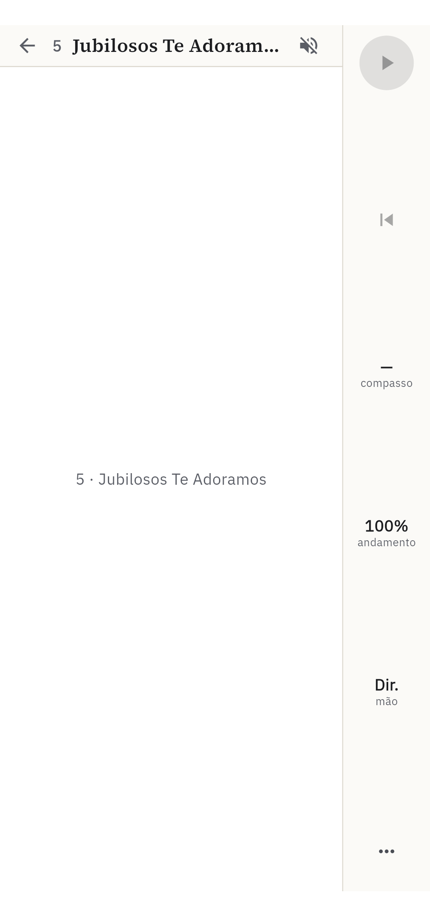

# Estudo de UX — retrato e paisagem no celular

Avaliação das telas fotografadas nas **duas orientações** (2026-10-06,
`main` em `942c4aa`): [`docs/telas/celular/retrato/`](../telas/celular/retrato/)
e [`docs/telas/celular/paisagem/`](../telas/celular/paisagem/), lado a lado em
[`docs/telas/ORIENTACAO.md`](../telas/ORIENTACAO.md). Os números entre
parênteses — (02), (30) — são os das telas, os mesmos de
[`celular/README.md`](../telas/celular/README.md); **R** e **P** dizem a
orientação.

Este estudo complementa o [estudo da fase U](estudo-ux-celular.md), que olhou
cada tela só na orientação em que o app a mostrava. Aqui a pergunta é outra:
**o que acontece quando o aparelho está na outra posição?** Também registro o
que mudou desde as fotos de 05/10 (cursos da fase I e o giro da biblioteca).

## Método e limites

- Mesmo método do estudo anterior: avaliação heurística, de um avaliador só,
  sobre as fotos e o código. Os achados são hipóteses fundamentadas, não
  medições com alunos.
- **Como as fotos foram feitas.** O roteiro `just telas` ganhou
  `--dart-define=ZYWNY_TELAS_ORIENTACAO=retrato|paisagem`: o tamanho da tela
  é fixado no Flutter (1080×2274 ou 2274×1080 px, 411×866 dp no emulador
  `Medium_Phone_2`) para todas as telas. As barras do sistema viram margens
  fixas (24 dp de status e 16 dp de navegação em retrato; nenhuma em paisagem).
  Isso é um bom retrato do layout, mas não do Android: o giro de verdade, o
  teclado virtual e as barras reais não aparecem.
- **A partitura só existe em paisagem** no celular (trava em `lib/main.dart:440`
  e não grava a página numa caixa em retrato, `lib/main.dart:615`). Na
  passagem em retrato ela abre deitada e **não é fotografada**: 10–25 e 30–45
  só têm a versão P. A foto
  [`retrato/extra-partitura-em-retrato.png`](../telas/celular/retrato/extra-partitura-em-retrato.png)
  mostra o que aconteceria se a trava não valesse (ver O4).
- Na passagem em paisagem, o roteiro gira a tela para retrato só pelo instante
  de tocar no hino, porque em paisagem a lista não aparece (O1).
- A foto 55 ("Conecte o teclado" no exercício) não sai em nenhuma das duas: é
  o defeito X1.
- 47 sai com botões roxos nas duas orientações porque o roteiro monta a
  biblioteca sem o tema do app (`MaterialApp` puro). Não é achado.

Gravidade: **alta** — engana o aluno ou trava o caminho principal;
**média** — atrapalha, mas ele passa; **baixa** — acabamento.

## Resumo

O app foi desenhado com uma orientação por tela: biblioteca em retrato e
partitura em paisagem. Desde o `cfcf647` (05/10), a biblioteca e os cursos
seguem o giro do aparelho, e é aí que mora o achado mais grave: **em
paisagem a biblioteca não mostra nenhum hino.** O caso não é raro. Quem
estuda põe o celular deitado na estante do piano, e é assim que ele volta da
partitura, que é sempre paisagem.

Fora isso, as telas de curso e de exercício aguentam bem as duas orientações.
Os problemas novos são de texto (quebras de linha no meio das frases das
lições), de estado (o exercício não percebe que o teclado caiu), de espaço (em
paisagem, o resultado do exercício cobre a partitura) e, na partitura, a página
parada no meio da virada ao retomar a trilha (a confirmar).

Se só der para fazer três coisas: **O1**, **X1** e **X2**, e conferir **P1** num aparelho.

## Mapa: cada tela em cada orientação

| Telas | Retrato | Paisagem |
|---|---|---|
| Abertura (01) | boa | boa, outro arranjo (logo ao lado do nome) |
| Biblioteca (02–05, 26–28, 46, 49) | boa; busca apertada com o teclado (O2) | **sem nenhum hino na tela** (O1) |
| Seletor de teclado (06, 29) | bom | bom |
| Configurações gerais (07–09) | boas | boas (cartão central, rola) |
| Partitura, trilha, treino (10–25, 30–45) | não existe (trava) | é a orientação do desenho |
| Lista de cursos, curso (50, 51) | bons | bons; a "Apresentação" aberta ocupa a tela toda (O3) |
| Lições (48, 52–54, 57) | boas, com quebras de linha erradas (X2) | coluna de leitura boa; figura grande demais (X6) |
| Exercício de botões (56, 58) | bom, metade de baixo vazia | bom, compacto |
| Exercício com teclado (59, 60) | bom; partitura em dois sistemas, resultado embaixo dela | partitura numa linha; **o resultado cobre a partitura** (X9) |

## Achados

### O — Orientação

**O1 · alta · Em paisagem, a biblioteca não mostra nenhum hino.**
(P02, P03, P04, P05, P26, P27, P28, P46, P49)

Em paisagem a tela tem ~411 dp de altura. O topo da biblioteca é fixo:
título, linha "Cursos", busca, cartão "Comece por aqui" ou "Continuar" e
ordenação. Esse topo ocupa a altura inteira, e a lista fica num `Expanded`
com o que sobra, que é nada (`lib/library/library_screen.dart:572-618`).
Consequências:

- a lista de 600 hinos simplesmente não aparece; em P26 aparece só o topo da
  primeira linha;
- a busca (P03) aceita o texto e não mostra resultado nenhum, nem a mensagem
  de "nenhum hino" (P04);
- trocar a ordenação (P05, P28) não muda nada visível;
- não há rolagem que resolva: o que rola é a lista, e ela tem altura zero.

Até o `cfcf647` a biblioteca era travada em retrato; o I13 passou a seguir o
aparelho (`_followDevice`, `library_screen.dart:379`) para os cursos girarem
junto. O celular deitado na estante, voltando de um hino, cai direto aqui.

- Rápido: travar de novo a biblioteca em retrato (cursos e lições continuam
  seguindo o aparelho, que eles aguentam).
- Melhor: o topo rola junto com a lista (`CustomScrollView`, com a busca e a
  ordenação presas no alto ao rolar). Em paisagem sobra largura: um arranjo de
  duas colunas (cartões à esquerda, lista à direita) mostra ~5 hinos de uma vez.

**O2 · média · Em retrato, a busca fica atrás do teclado virtual.** (R03, R04)

Os resultados começam a ~51% da altura (R03): acima deles ficam a linha
"Cursos", a busca, o cartão "Comece por aqui" e a ordenação. O teclado
virtual do Android cobre ~40% de baixo, então o aluno digita e vê um ou dois
resultados (a foto não mostra o teclado: o espaço é o dele). A mensagem
"Nenhum hino com 'chopin'" (R04) também cai no meio da tela, onde estaria o
teclado.

- Com a busca em foco, esconder o cartão "Comece por aqui"/"Continuar" e a
  linha "Cursos". A ordenação pode ficar, porque é curta.
- A mesma regra alivia O1, se o topo continuar fixo.

**O3 · baixa · A "Apresentação" do curso nasce aberta e empurra as lições.**
(R51, P51)
Em paisagem ela ocupa a tela inteira, e a única lição visível é "O teclado".
Em retrato, as lições começam abaixo da metade. O texto (crédito da lição 10
incluído) é para ler uma vez. Sugestão: aberta só na primeira visita; depois
recolhida, com a linha "Continuar: …" no lugar.

**O4 · baixa · Onde a trava não vale, a partitura fica em branco para sempre.**
(foto extra em `retrato/`)

A partitura pede paisagem e, numa caixa mais alta que larga, não grava a
página: fica esperando o giro (`lib/main.dart:611-615`). No celular o Android
gira e tudo bem. Já em tablets e dobráveis abertos, o Android 16 ignora a
trava de orientação dos apps que miram o SDK 36. Também em janela dividida, a
tela fica eternamente em "5 · Jubilosos Te Adoramos", com o play desabilitado
e sem explicação. Não é o alvo (ver a meta "celular, não tablet"), mas
custa pouco: depois de ~1 s em retrato, mostrar "Gire o aparelho para ver a
partitura" no lugar do título.

### X — Cursos e exercícios (fase I)

**X1 · alta · O exercício não percebe que o teclado caiu.** (55 ausente)
A porta "Conecte o teclado" só é escolhida no `build`
(`lib/course/ui/exercise_screen.dart:543`), e o ouvinte do teclado não pede
`setState` depois que a rodada começou (`exercise_screen.dart:166`). Se o cabo
solta ou o teclado desliga no meio de um `play-notes`, a tela continua
esperando notas que nunca chegam, sem aviso. O roteiro das telas tropeçou
nisso nas duas orientações: a foto 55 dependia de uma corrida que o emulador
de hoje não ganha mais.

- O ouvinte sempre reconstrói. Sem teclado, a rodada pausa e a porta aparece;
  ao voltar o teclado, a rodada recomeça.

**X2 · média · As frases das lições quebram no meio.** (R48, R51, R52, R53,
R54, R57; também P51, P52)

"Quanto mais alta a nota, mais / agudo o som." O markdown das lições é
escrito com quebra a ~80 colunas
(`assets/cursos/iniciacao/lessons/02-pauta-e-clave-de-sol.md:9`). Pela regra
do markdown essa quebra é um espaço, mas o `RichText` de
`lib/course/ui/markdown_view.dart:176-186` mantém o `\n`. Em retrato, com
linhas de ~45 caracteres, todo parágrafo fica serrilhado. Em paisagem se nota
menos, porque a coluna é larga. Corrigir no renderizador (quebra simples vira
espaço; só a linha em branco separa parágrafos), não no texto das lições.

**X3 · média · Cartão bloqueado com o botão "Começar" ativo.** (R57)
Os três cartões da lição 8 dizem "🔒 Depois de: Mais tempos" e mostram o
"Começar" azul, cheio, habilitado. Os dois sinais se contradizem: o cadeado
diz "ainda não", e o botão diz "vá". Se o desenho é "recomendado depois de"
(o curso deixa abrir com "Abrir assim mesmo"), o texto deve dizer isso sem
cadeado ("Melhor depois de: Mais tempos"). Se é bloqueio, o botão fica
desabilitado como o de "Precisa do teclado" (R54).

**X4 · média · "Precisa do teclado" sem saída.** (R54, P54)
O cartão diz "Precisa do teclado" e desabilita o "Começar", mas não oferece
"Conectar teclado", que existe na biblioteca e no seletor. É o mesmo beco do
A1 do estudo anterior, agora na lição. Sugestão: o rótulo vira botão
("Conectar teclado") e abre o seletor.

**X5 · baixa · Título do exercício cortado.** (R58)
"Para qu…" — o título perde para "rodada 1 meta 90% · 20s por pergunta" à
direita. Em retrato, a linha de apoio pode ir para baixo do título, ou o
"20s por pergunta" pode sair do cabeçalho (o cartão da lição já o diz).

**X6 · baixa · Figuras das lições.** (R52, R53, P53)
A figura "A clave de sol" tem fundo ciano saturado, o único elemento da lição
fora da paleta bege e azul. Em paisagem, esticada à largura da coluna, ocupa a
tela inteira (P53). Sugestão: fundo transparente ou papel, e altura máxima de
~40% da tela. O player de áudio mostra "0:00 / 0:00" antes do primeiro toque
(R53): sem a duração, parece quebrado.

**X7 · baixa · Duas metas.** (R54, R57, R58)
Exercícios pedem 80% ou 90%, e a trilha dos hinos pede 90%. Faz sentido
pedagógico, mas nada explica a diferença. Basta o texto "meta 80%" ganhar o
porquê na primeira vez ("aqui o objetivo é ler, não tocar no tempo").

**X8 · baixa · Configurações dizem que não há curso.** (R07, P07)
A seção "Cursos" diz "Nenhum curso instalado. O curso inicial não aparece
aqui." enquanto a biblioteca mostra "Primeiros passos ao piano" logo acima.
Tecnicamente certo (o embutido não é um pacote instalado), mas soa como
erro. Sugestão: listar o curso inicial como "embutido", sem a opção de
remover.

**X9 · média · Em paisagem, o resultado do exercício esconde a partitura.**
(P60 × R60)

Em retrato, o painel "100% · Exercício aprovado!" sobe por baixo e a
partitura continua à vista em cima (R60). Em paisagem, com 411 dp de altura,
o mesmo painel ocupa tudo, e a partitura some (P60). Quando houver erros, o
"marcados na partitura" aponta para algo que não está na tela. É a regra E2
do estudo anterior: em paisagem, o que fala da partitura entra pela lateral,
como o resumo da etapa (P34).

### P — Partitura (paisagem)

**P1 · alta, a confirmar · A página retomada fica parada no meio da virada.**
(P30, P35)

Ao retomar a trilha pelo "Continuar" (P30) e ao escolher a etapa seguinte
(P35), a partitura aparece borrada, com só o último compasso da página
anterior nítido atrás da haste azul. O aluno está **parado**, olhando o
trecho que vai tocar, e não consegue lê-lo. Nas fotos de 05/10 as mesmas
telas mostravam o trecho nítido e marcado. Aqui o defeito se repetiu nas
quatro passagens em paisagem. Pode ser regressão do `cfcf647`/`bc3d33c` (os
dois mexem em `lib/main.dart`) ou efeito do tamanho forçado do roteiro. Na
passagem forçada o aparelho não gira ao abrir o hino, e a gravação da página
pode seguir outro caminho. Conferir num aparelho antes de mexer.

**P2 · baixa · Rótulo cortado na barra lateral.** (P11, P30, P33, P37)
Sob a mão da etapa aparece "mão da" — o "etapa" não cabe nos 84 dp da barra.
"da etapa" sob o andamento cabe (P37); sob a mão, não. Sugestão: "mão" só,
como no treino livre.

**P3 · baixa · O texto da etapa some na barra do título.** (P37, P38)
"Trecho 1/6 · Tudo junto no ritmo 50% · 98…" — com etapa de nome longo, a
parte cortada é o que o aluno queria ler. O andamento já está na barra
lateral ("50% da etapa"), então pode sair do título.

Continuam abertos do estudo anterior e aparecem nestas fotos: a primeira
nota verde com a etapa parada (P11, P13), o borrão da virada atrás dos
resumos (P34, P39, P42), a cifra "C7sus♮(7)" sobreposta (P21) e a linha do
hino cortando o "melhor" (R27).

### Biblioteca em retrato — miúdos

- **Ordenação rolada esconde a escolha** (R05): depois de rolar as pastilhas
  até "Dificuldade", a escolhida fica cortada na borda ("ficuldade ↑"). Em
  retrato cabem quatro das seis; ao escolher, centralizar a pastilha.
- **Seletor de teclado apertado** (R29): "Teclado digital" quebra em duas
  linhas para caber "Desconectar" ao lado. O botão pode ir para baixo do
  nome.

## Prioridade

| # | Achado | Gravidade | Esforço |
|---|---|---|---|
| O1 | Biblioteca sem hinos em paisagem | alta | baixo (travar) / médio (rolar junto) |
| X1 | Exercício não percebe o teclado cair | alta | baixo |
| P1 | Página parada na virada ao retomar | alta, a confirmar | ? |
| X2 | Frases das lições quebradas | média | baixo |
| O2 | Busca atrás do teclado virtual | média | baixo |
| X3 | Cadeado com "Começar" ativo | média | baixo |
| X9 | Resultado do exercício cobre a partitura em paisagem | média | médio |
| X4 | "Precisa do teclado" sem saída | média | baixo |
| O3 | Apresentação do curso sempre aberta | baixa | baixo |
| O4 | Partitura em branco onde a trava não vale | baixa | baixo |
| X5–X8, P2, P3 | acabamento | baixa | baixo |

## Como refazer

    emulator -avd Medium_Phone_2 -read-only -no-window -no-audio &
    adb push dist/hinos.zywny /data/local/tmp/hinos.zywny
    TELAS_DIR=docs/telas/celular/retrato just telas \
        --dart-define=ZYWNY_TEST_LIBRARY=/data/local/tmp/hinos.zywny \
        --dart-define=ZYWNY_TELAS_ORIENTACAO=retrato
    # idem com paisagem

Sem `ZYWNY_TELAS_ORIENTACAO`, o roteiro faz o de sempre (cada tela na
orientação do app, em `docs/telas/celular/`).
